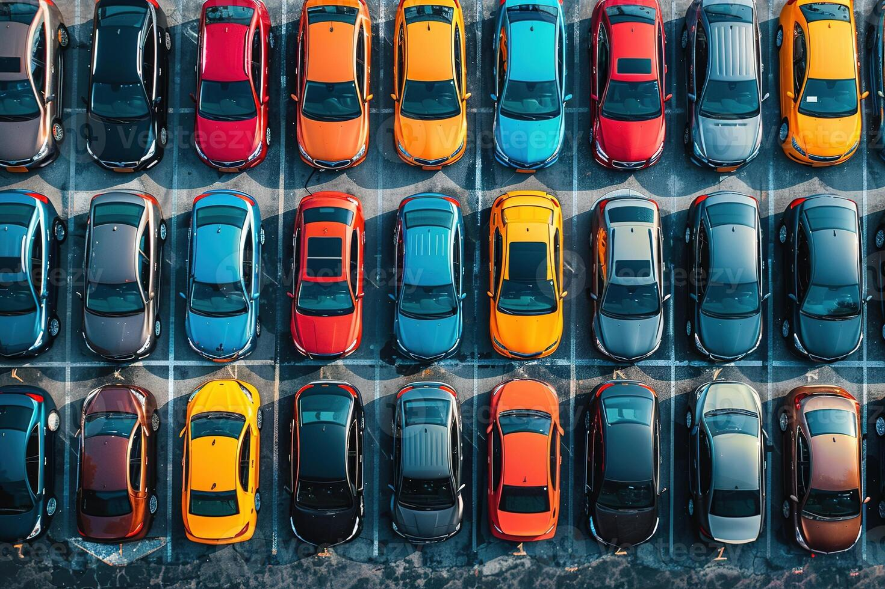
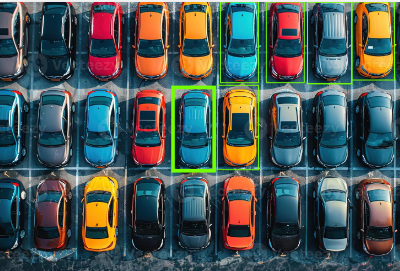
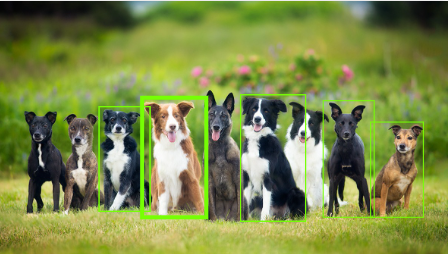
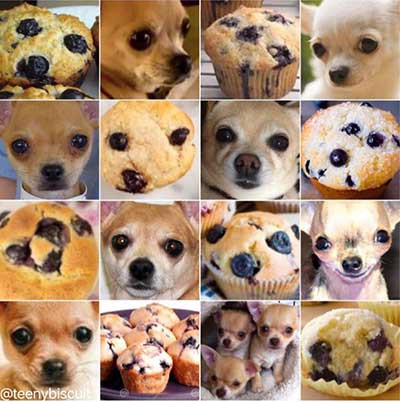
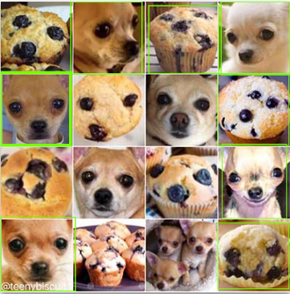

## Introdução

Imagens têm sido utilizadas há anos como um meio para transmitir informações. Essas informações podem variar desde um conjunto de sentimentos até dados específicos, como a fotografia de um slide de aula, vídeos (que consistem em sequências de imagens) ou obras de arte codificadas neste formato. É um fato reconhecido que imagens podem carregar informações extremamente valiosas e, por isso, a análise de imagens tem sido um campo de estudo importante desde seus primórdios.

Com o avanço da tecnologia e da computação, a capacidade de extrair informações de imagens e vídeos foi significativamente ampliada, transformando processos que eram antes manuais e laboriosos em ferramentas rápidas e mais eficientes. Áreas como visão computacional e processamento de imagens são dedicadas a extrair essas informações através de diversos meios.

Nos últimos anos, o advento do machine learning e do deep learning trouxe mudanças fundamentais a esses campos de estudo. Em resumo, as inovações em tecnologia têm revolucionado a forma como analisamos e interpretamos imagens, prometendo continuar a evoluir e impactar nossas vidas de maneiras até então inimagináveis.

#### Componentes
Vários componentes são substanciais para a aplicação eficiente e precisa dos conceitos de processamento de imagem.

##### Computador
Computadores são indispensáveis na visão computacional, servindo como pilares centrais para a execução de softwares avançados, visualização de imagens, e aplicação de algoritmos de processamento e redes neurais.

##### Armazenamento
O armazenamento é vital devido à diversidade em tamanho, resolução, formato e compressão das imagens. Levando em conta também o machine learning e o Deep Learning, o volume imenso de dados necessários para treinamento, junto às características únicas de cada imagem, exige um sistema de armazenamento sólido. Este deve garantir a integridade dos dados de forma consistente, segura e acessível. Exemplos de soluções de armazenamento incluem bancos de dados baseados em objetos, plataformas de cloud storage e serviços de armazenamento em arquivo.

##### Imagens
As imagens são o principal insumo dessa área de pesquisa, sendo representações visuais de pessoas ou objetos. Elas contêm informações codificadas tanto em suas representações quanto quando analisadas em conjunto com outras imagens. Utilizando esses elementos, a visão computacional procura extrair informações quantificáveis que podem ser aplicadas em variados contextos.

### Classificação

Na visão computacional, classificar uma imagem envolve categorizar e atribuir etiquetas (labels) a conjuntos de pixels. Este processo geralmente emprega sistemas de reconhecimento de padrões, que podem ser:

- **Machine Learning:** Utilizando redes neurais para aprender padrões.
- **Deep Learning:** Com arquiteturas complexas para análise mais profunda.
- **Algoritmos Clássicos:** Baseando-se em análises de dados espectrais ou de textura.

Em suma, o objetivo principal é extrair um significado das imagens, independentemente da tecnologia utilizada.

#### Supervisionado
O aprendizado supervisionado, um subset importante de machine learning, envolve:
- Definir um conjunto de dados de treino.
- Estruturar um modelo que aprende com esses dados.
- Realizar predições e compará-las com etiquetas reais (truth labels).
- Ajustar o modelo de acordo com a performance.

Portanto, este método é predominantemente utilizado para análises quantitativas de dados de imagens.

#### Não-Supervisionado
O aprendizado não-supervisionado, se distingue por não usar labels pré-definidas, focando em:
- Descobrir padrões e correlações nos dados.
- Potencialmente, criar novos labels ou formar clusters.

Este método oferece a vantagem de economizar recursos anteriormente dedicados à coleta de dados com labels.

#### Semi-Supervisionado
No aprendizado semi-supervisionado, utilizado quando os dados etiquetados são escassos:
- Inicia-se o treino com os dados com label disponíveis.
- Gradualmente, incorporam-se novos dados, extrapolando a partir das informações previamente aprendidas.

Este método representa uma síntese das abordagens supervisionadas e não-supervisionadas, otimizando o processo de aprendizado.

### Detecção de Objetos

Dentro do amplo campo da visão computacional, a detecção de objetos é uma das áreas mais importantes. Esta técnica envolve a identificação e localização de objetos dentro de uma imagem, geralmente delimitando-os com "bounding boxes". O processo se baseia na determinação das coordenadas do objeto na imagem, facilitando a sua identificação.

### Reconhecimento de Objetos

Relacionado à detecção, o reconhecimento de objetos é outro aspecto importante da visão computacional. Neste processo, além de identificar a localização dos objetos com bounding boxes, o modelo também é capaz de classificar e descrever o tipo de objeto detectado, como por exemplo, um rosto humano ou um carro em movimento. O objetivo principal é permitir que o modelo reconheça e entenda as características dos objetos de maneira similar aos humanos. Com o advento do Machine Learning, houve uma significativa expansão na capacidade de reconhecimento e análise de padrões dos objetos, superando muitas limitações dos sistemas convencionais.

#### Uso de Machine Learning na Detecção e Reconhecimento de Objetos

- **HOG (Histogram of Oriented Gradients)** - Uma técnica para extração de características que é frequentemente usada para detecção de objetos.
- **Bag of Features** - Método que envolve representar imagens como uma coleção de "features" independentes, o que ajuda na classificação e reconhecimento.
- **Viola-Jones Algorithm** - Algoritmo para detecção rápida de faces, que utiliza características simples.

#### Aplicação de Deep Learning

- **CNNs (Convolutional Neural Networks)** - Redes neurais especializadas em processar dados como imagens, sendo extremamente eficazes para tarefas de reconhecimento visual devido à sua capacidade de desenvolver uma hierarquia de padrões.

Ao incorporar estas técnicas avançadas, a visão computacional continua a evoluir, melhorando não apenas a precisão, mas também a eficiência dos processos de detecção e reconhecimento de objetos.

### Segmentação de Imagens

A segmentação de imagens é um processo avançado que vai além da simples detecção de objetos. Este método identifica objetos dentro de uma imagem, criando máscaras para cada um, além de definir as áreas de um objeto ao nível de pixels e atribuir classes específicas para cada segmento. Isso representa uma abordagem mais granular de detecção, amplamente utilizada em campos como o processamento de imagens médicas e imagens de satélites.

#### Segmentação de Instâncias

Na segmentação de instâncias, cada objeto é identificado e classificado de forma independente, mesmo que vários objetos da mesma classe estejam presentes. Este método é útil para:
- Distinguir individualmente cada instância de objeto.
- Utilizar cores diferentes para representar cada classe, facilitando a visualização e análise.

#### Segmentação Semântica

A segmentação semântica, por outro lado, agrupa todos os objetos de uma mesma classe, independentemente de suas instâncias individuais. Este método foca em:
- Distinguir e agrupar elementos semelhantes, atribuindo a mesma classe a todos os elementos correlacionados.
- Melhorar a coerência e a consistência da informação visual apresentada.

#### Aplicações de Deep Learning em Segmentação

- **R-CNN (Regions with Convolutional Neural Networks)**: Utilizado para melhorar a precisão na identificação e segmentação de objetos específicos dentro de uma imagem.

Essas técnicas de segmentação, suportadas por avanços em Deep Learning, ajudam no entendimento e manipulação das imagens, correlacionando e identificando padrões complexos, permitindo dessa forma, sua aplicações em diversos setores como industriais e de pesquisa.

### Representação e Descrição de Imagens

Após a segmentação de uma imagem em regiões, cada uma é detalhadamente descrita e representada para facilitar a extração de informações subsequentes. Este processo é essencial para diferenciar classes de objetos com base em dados quantitativos.

## Tarefas Analisadas

Neste estudo, foram discutidos dois processos distintos de análise de imagens:

1. **Classificação**
2. **Detecção de Objetos**

#### Classificação

A classificação serve para categorizar objetos dentro de uma imagem, com aplicações variando significativamente entre diferentes setores:

- **Direção Autônoma:** Na direção autônoma, a classificação ajuda a identificar e reagir a objetos ao redor do veículo, como outros carros ou sinais de trânsito. Por exemplo, um sistema capaz de reconhecer e interpretar uma placa de "Pare" pode instruir o veículo a parar automaticamente.
  
- **Controle de Qualidade:** Na indústria de envasamento, a classificação determina se um item na esteira é um vegetal ou uma fruta, além de atribuir níveis de qualidade para futura seleção.

#### Detecção de Objetos

A detecção de objetos envolve localizar e identificar objetos em uma imagem, usando técnicas como bounding boxes para marcar visualmente os objetos detectados. Este processo auxilia em sistemas de monitoramento, segurança automatizada e muitas outras aplicações tecnológicas. Somada a técnicas de segmentação e classificação, a detecção de objetos é uma ferramenta poderosa, não se limitando a um único setor. 

- **Segurança e Vigilância:** Utilização de câmeras de segurança equipadas com software de detecção de objetos para identificar atividades suspeitas ou não autorizadas automaticamente ou mesmo sistemas de alarme que identificam a presença de pessoas em locais e horários não autorizados.
- **Saúde**: identificação e localização de tumores, fraturas ou outras anomalias em imagens de raio-X, MRI ou CT scans. Câmeras que monitoram pacientes, especialmente em unidades de cuidados intensivos, para detectar problemas ou necessidades sem intervenção humana constante.

##### Plainsight FilterBox

O **Plainsight FilterBox** é uma solução que extrai inteligência e informações de imagens para auxiliar na tomada de decisão. Esta ferramenta é projetada para ser prática e acessível, mesmo para usuários sem conhecimento técnico avançado, oferecendo qualidade e privacidade conforme as normas de compliance específicas de cada empresa. 

Um exemplo de sua aplicação é no controle de rebanhos para empresas de agronegócio. Utilizando detecção de objetos, o sistema identifica e monitora animais individualmente, fornecendo informações importantes para a gestão do rebanho. Além disso, em situações que requerem monitoramento de infraestrutura, como no caso dos tanques de armazenamento, o FilterBox estima e acompanha o nível dos tanques usando câmeras térmicas, sem necessidade de abertura física dos mesmos.

##### Google CloudVision

O **Google CloudVision** por sua vez, oferece uma plataforma robusta de visão computacional que analisa imagens e vídeos para identificar objetos, rostos, textos, e outros elementos. A solução adapta-se às necessidades do cliente, classificando os dados identificados de forma útil para os processos de negócio. Com integração nativa ao Google Cloud, esta ferramenta simplifica a implementação de visão computacional ao se conectar facilmente com outros sistemas e APIs, expandindo as possibilidades de aplicação.

#### Segmento de Mercado dos Produtos

Ambos os produtos, **Plainsight FilterBox** e **Google CloudVision**, são projetados para atender um amplo espectro de indústrias devido à sua flexibilidade e capacidade de integração:

- O **Plainsight FilterBox** é ideal para setores que necessitam de soluções práticas e eficientes para monitoramento e controle de qualidade, como a indústria e o agronegócio, sem depender de conhecimento técnico avançado.
- O **Google CloudVision** se destaca em ambientes que valorizam a integração tecnológica a sistemas ou infraestruturas existentes, de forma escalável, graças à sua compatibilidade com ambientes em nuvem.

A escolha entre o Plainsight FilterBox e o Google CloudVision depende das necessidades específicas de cada empresa, seu orçamento, e o nível de integração técnica necessária. Ambos os produtos oferecem soluções escaláveis e adaptáveis com capacidade significativa de melhorar a eficiência e eficácia dos processos empresariais, através da visão computacional.

### Teste de Produtos

#### Google CloudVision
Devido a restrições operacionais do Filterbox e à necessidade de um cadastro de pagamento para usar o Google CloudVision, os testes foram realizados exclusivamente na página de testes do Google CloudVision. O foco estava em testar a detecção de objetos e a classificação de imagens utilizando exemplos variados, incluindo carros, cachorros e chihuahuas.

#### Resultados

##### Teste com Imagens de Carros

- **Descrição do Teste:** Uma imagem aérea mostrando 27 carros de diferentes cores.
- **Resultados Obtidos:** Detectou 6 carros, classificando-os como veículos de brinquedo e, em alguns casos, simplesmente como "brinquedo". Não identificou todos os carros corretamente nem classificou seus tipos exatos.
- 

##### Teste com Imagens de Cachorros

- **Descrição do Teste:** Uma imagem contendo 9 cachorros de diversas raças e cores.
- **Resultados Obtidos:** Identificou 5 dos 9 cachorros, classificando todos corretamente como "cachorro".

##### Teste com Imagens de Chihuahuas e Muffins

- **Descrição do Teste:** Uma imagem dividida em 16 blocos, incluindo 8 blocos de chihuahuas e 8 blocos de muffins.
- **Resultados Obtidos:** Corretamente identificou 5 chihuahuas e 3 muffins, classificando-os como "Chihuahua", "Cachorro" ou "Animal", e "Muffin", respectivamente.

#### Conclusão

Avaliando a capacidade do Google CloudVision de processar e classificar imagens com complexidades visuais variadas, observa-se uma eficiência notável na detecção e classificação de objetos. Embora a ferramenta tenha conseguido identificar corretamente a maioria dos objetos nas imagens testadas e classificá-los de acordo com suas características visuais, os testes deixaram a desejar na detecção de todos os elementos. Especificamente, a capacidade do sistema em detectar, a nível de quantidade, todos os objetos, não foi consistentemente forte em todos os testes.

Dado que apenas três imagens foram usadas para esses testes, é difícil avaliar completamente a qualidade e a confiabilidade do modelo. Portanto, para obter uma compreensão mais abrangente e justa da capacidade real do Google CloudVision, seria essencial realizar um conjunto mais extenso de testes com uma variedade maior de imagens.

### Fontes

- [Encyclopedia Britannica: Image Processing](https://www.britannica.com/technology/image-processing)
- [Simplilearn: What is Image Processing?](https://www.simplilearn.com/image-processing-article#:~:text=Image%20processing%20is%20the%20process,certain%20predetermined%20signal%20processing%20methods)
- [PyImageSearch: Image Classification Basics](https://pyimagesearch.com/2021/04/17/image-classification-basics/)
- [Roboflow Blog: Object Detection](https://blog.roboflow.com/object-detection/)
- [MathWorks: Object Recognition Solutions](https://www.mathworks.com/solutions/image-video-processing/object-recognition.html#:~:text=Object%20recognition%20is%20a%20computer,%2C%20scenes,%20and%20visual%20details)
- [GeeksforGeeks: Object Detection vs. Object Recognition vs. Image Segmentation](https://www.geeksforgeeks.org/object-detection-vs-object-recognition-vs-image-segmentation/)
- [arXiv: Selective Search for Object Recognition](https://arxiv.org/pdf/1311.2524.pdf)
- [Towards Data Science: HOG - Histogram of Oriented Gradients](https://towardsdatascience.com/hog-histogram-of-oriented-gradients-67ecd887675f)
