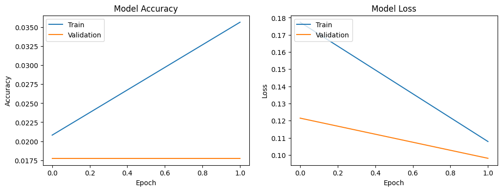

# README.md

## Pose Estimation for Cattle

This project implements pose estimation for cattle using the ANIMAL-POSE DATASET. The steps involved include dataset acquisition, exploratory analysis, image processing and filtering, model training, and result analysis.

### Table of Contents
1. [Dataset Acquisition and Exploratory Analysis](#dataset-acquisition-and-exploratory-analysis)
2. [Image Processing and Filtering](#image-processing-and-filtering)
3. [Final Results](#final-results)
4. [Conclusions](#conclusions)

## Dataset Acquisition and Exploratory Analysis

### Obtaining the Dataset
The dataset used in this project is the ANIMAL-POSE DATASET, which includes images and keypoints for various animals, including cattle.

### Exploratory Analysis
Exploratory data analysis helps understand the dataset's characteristics, identify potential biases, and plan preprocessing steps. Key findings include:

- **Category Distribution**: The dataset is unevenly distributed, with the majority of images representing dogs and the least number of images representing cattle (842 images).
- **Color Intensity and Pixel Distribution**: Analyzing the color intensity and pixel distribution of sample images from each category reveals typical color patterns and potential biases. For example, dog images show significant dark blueish tones, while cow images have mid-range intensity colors.

## Image Processing and Filtering

### Filtering Cattle Images
The dataset was filtered to include only cattle images for this project.

### Image Resolution Setting
Image resolution was standardized to ensure uniform processing.

### Keypoints Visualization
Keypoints on the cattle images were visualized to ensure correctness.

### Augmentation and Processing Pipeline
Data augmentation techniques, such as random cropping and brightness adjustment, were applied to enhance the training dataset.

## Final Results

### Model Description
A simple Convolutional Neural Network (CNN) was used for the pose estimation task. The model consisted of three convolutional layers, followed by a fully connected layer and an output layer predicting the keypoints.

### Training and Validation
The model was trained and evaluated, showing the following key points:
- **Training Accuracy**: Gradually increased over epochs, indicating the model's learning process.
- **Validation Accuracy**: Remained low and constant, suggesting potential underfitting.

### Performance Metrics
Training and validation accuracy and loss were plotted to visualize the model's performance. The low validation accuracy indicates that the model struggled with generalization, possibly due to the limited complexity of the CNN architecture and the short training duration.

## Conclusions

### Observations
During the training process, the model exhibited a gradual increase in training accuracy, signifying that it was learning and adapting to the dataset. However, the validation accuracy remained consistently low and showed no significant improvement over the epochs. This discrepancy between training and validation performance indicates that the model might be underfitting. Underfitting occurs when a model is too simple to capture the underlying patterns in the data, resulting in poor performance on both training and unseen data. The simple Convolutional Neural Network (CNN) architecture employed in this project, while effective for basic image recognition tasks, may lack the complexity required for the nuanced task of pose estimation in cattle images.

### Limitations
Several limitations were encountered throughout this project. One significant constraint was the limited training duration due to computational resource restrictions. Training deep learning models, especially for tasks as intricate as pose estimation, typically requires extensive computational power and time to achieve optimal performance. The constrained training time likely contributed to the model's inability to learn effectively from the dataset.

Moreover, the simple CNN architecture used in this project may not have been sufficient. More complex architectures with deeper layers and advanced features could potentially improve the model's performance by capturing more intricate patterns in the data.

### Future Work
To enhance the model's performance and address the identified limitations, future work should focus on the following areas:

**Utilize Advanced Architectures**: Implementing more complex neural network architectures such as ResNet or MobileNet can improve the model's ability to capture detailed features and enhance pose estimation accuracy.

**Enhance Data Augmentation**: Employing advanced data augmentation techniques, including rotation, scaling, horizontal flipping, and random cropping, can create a more diverse training set and improve the model's robustness to variations in input images.

**Extend Training Duration**: Increasing the training duration and using more powerful computational resources will allow the model to better learn from the data and achieve improved performance on both training and validation sets.

### References
- ANIMAL-POSE DATASET: [Animal Pose Dataset](https://sites.google.com/view/animal-pose/)
